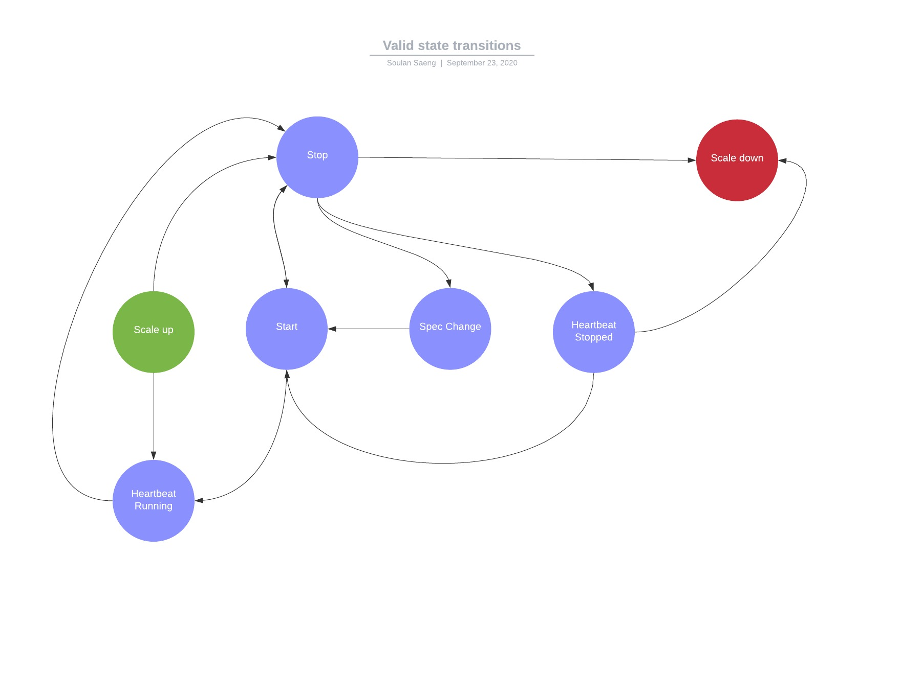

### Metered Billing Pipeline Test

This is the experimental project for the metered billing e2e test. It is divided into two parts :

1. `Event Generator` Responsible for generating mock usage event data from a fleet.
2. `Spend Verifier` Responsible for verifying that the spent amount given to us from the uBazaar API reflects the mock usage.
 This component will generate an alert if the spent amount is inconsistent with our usage patterns.
 
### Notes

At the moment only the generator function has been implemented. The work to deploy it as a cloud function is ongoing.

#### Running the simulator

Given a fleet defined in the configuration, the simulator will simulate a machine's lifecycle. 

To start the simulation :
```bash
 go run main.go -config=config.json 
```

#### Modifying the workflow

The simulation workflow for a machine is defined in the `transitions` field in the configuration file.
Extra states can be added to extend the workflow. 
```json
  "transitions": [
    {
      "state": "stop",
      "duration": 2
    },
    {
      "state": "spec_change",
      "duration": 2
    },
    {
      "state": "start",
      "duration": 10
    },
    {
      "state": "stop",
      "duration": 2
    },
    {
      "state": "start",
      "duration": 10
    },
    {
      "state": "stop",
      "duration": 2
    },
    {
      "state": "scale_down",
      "duration": 2
    }
  ],
```

Valid transitions are defined in the following graph 
